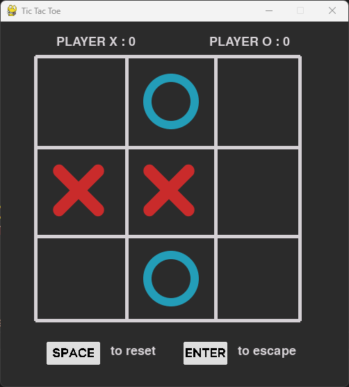

# TicTacToe
## Le jeux du Morpion / TicTacToe en Python

### **Voici mon tout premier jeu (Finis) coder avec le langage Python**

Une version executable du jeu est bientot disponible. 

Pour le moment, voici quelques exigences :

1 - Téléchargez le répertoire en dossier compressé afin d'installer le fichier source

2 - Installer la derniere version de [Python](https://www.python.org/downloads/) ainsi que les [librairies nécessaires](https://www.pygame.org/download.shtml) pour executer le jeu

3 - Lancer un terminal de commande depuis le répertoire actuel puis tapez la commande :

```bash
py main.py
```

4 - Profitez du jeu et battez votre record ! 😅





✅ De nouvelles fonctionnalites seront ajouter au fil du temps, Voici quelques exemple de fonctionnalites qui seront presentes :
* Menu d'interaction avec options 
* Jouer contre l'IA ou contre un joueur en ligne
* Personnalisation, themes, couleurs, image de fond 

**D'autres projet sont en cours ... ⏳**


Fait avec ❤️.

_Author: nadirgharbi_  
_version: v1.1_  
